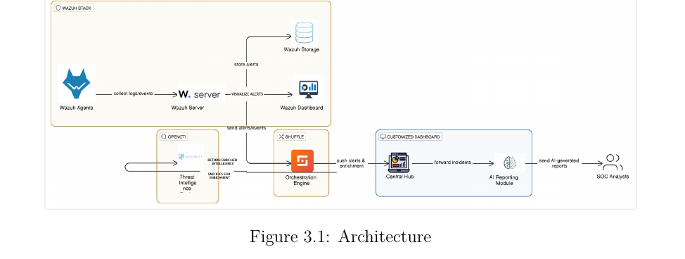
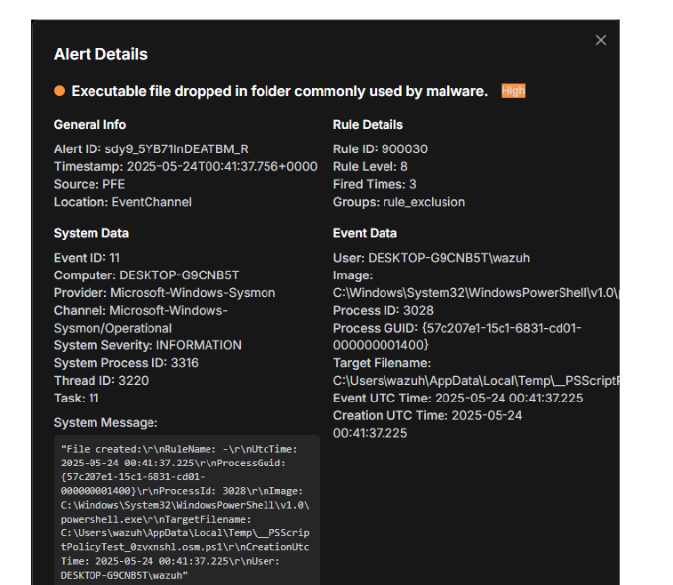
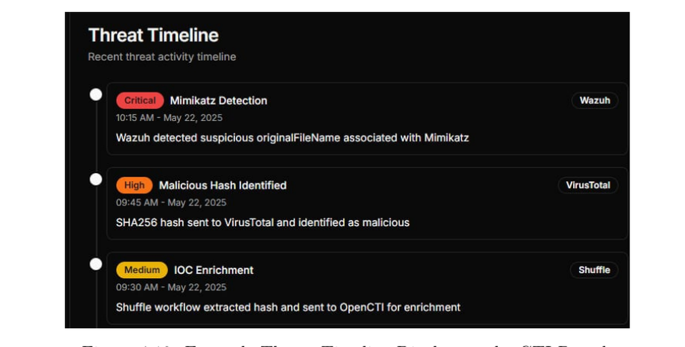

Final-year project (License) at **ANCS**, 2024–2025, with Koussay Bedoui. Supervised by Mr. Chekib Hantous and Mrs. Rim Bouhouch.

## What it does

- **Wazuh** handles detection.
- **Shuffle** orchestrates the response workflow.
- **OpenCTI** enriches alerts with threat intelligence from OTX and VirusTotal.
- A local **Mistral 7B** model writes contextual, real-time incident reports.
- Everything is surfaced in a **custom Next.js dashboard** I built (dashboard, incidents, detection performance, threat intelligence and AI-generated reports views).

I moved deliberately away from heavier components (TheHive, Kibana) in favour of the custom dashboard, so the analyst starts from context instead of a raw alert.

## Stack

Wazuh · Shuffle · OpenCTI · Mistral 7B (GGUF) · FastAPI · Next.js

## Architecture

The full workflow: Wazuh collects and detects, Shuffle parses alerts and pulls IOCs, OpenCTI enriches them against OTX and VirusTotal and maps to MITRE ATT&CK, a local Mistral 7B writes the incident report, and everything lands on the custom dashboard.

## The dashboard

A detailed alert view: the analyst gets the full event context — process, image, target file, rule level and ATT&CK mapping — without leaving the portal.

The threat timeline ties the pieces together: a Wazuh Mimikatz detection, a VirusTotal hash verdict and a Shuffle enrichment step, in one view.
