A Hack The Box Sherlock: identifying a phishing email, pivoting through OSINT and MITRE ATT&CK mapping, and tracing it to a known APT and a live supply-chain campaign.

## Task 1: Identify the sender of the suspicious email

I wrote a quick Python script to scan the `.eml` files and flag suspicious sender domains:

```python
import email
import os
from email import policy
import re

def is_suspicious(sender):
    suspicious_domains = ['.xyz', '.top', '.info', '.ru', '.cn']
    domain = sender.split('@')[-1].lower()
    if any(domain.endswith(d) for d in suspicious_domains):
        return True
    if len(sender) > 50:
        return True
    if re.search(r'[0-9]{5,}', sender):
        return True
    return False

def read_eml_file(file_path):
    try:
        with open(file_path, 'r', encoding='utf-8') as file:
            msg = email.message_from_file(file, policy=policy.default)
        sender = msg['from']
        if sender:
            email_match = re.search(r'<(.+?)>', sender) or re.search(r'[\w\.-]+@[\w\.-]+', sender)
            return email_match.group(1) if email_match else sender
        return None
    except Exception as e:
        print(f"Error reading {file_path}: {e}")
        return None

def process_eml_files(directory):
    senders = []
    suspicious_sender = None
    for filename in os.listdir(directory):
        if filename.endswith('.eml'):
            file_path = os.path.join(directory, filename)
            sender = read_eml_file(file_path)
            if sender:
                senders.append(sender)
                if is_suspicious(sender):
                    suspicious_sender = sender
    if suspicious_sender:
        print(f"Suspicious sender detected: {suspicious_sender}")
        return [suspicious_sender]
    else:
        print("No suspicious senders detected. All senders:")
        for sender in senders:
            print(sender)
        return senders

if __name__ == "__main__":
    process_eml_files(os.getcwd())
```

The heuristics came back empty, so I checked the list of senders manually:

```
dan@tldrnewsletter.com
newsletters@nl.technologyadvice.com
oren@softwareleadweekly.com
hello@uxdesign.cc
no-reply@clickmeeting.com
facundo.capunti@proton.me
newsletters@techcrunch.com
theodore.todtenhaupt@developingdreams.site
```

One stands out: `theodore.todtenhaupt@developingdreams.site`. Reading the email:

> Dear Jason,
>
> I hope this message finds you well. I am following up on our quick chat on X to discuss an exciting investment opportunity in an NFT game project that is nearing completion... The DevelopingDreams is currently in the process of developing a new play-to-earn (P2E) game. We finished beta version of this game but need expert game developers because of issues and new version.
>
> Here (developingdreams.site/release/beta_release_v.1.32.zip) you can find the beta version of the game for testing (use password DTWBETA2025).
>
> Best regards,
> Theodore Todtenhaupt, DevelopingDreams, CEO

**A:** `theodore.todtenhaupt@developingdreams.site`

## Task 2: Domain creation date

Checked `developingdreams.site` on the Wayback Machine's WHOIS view.

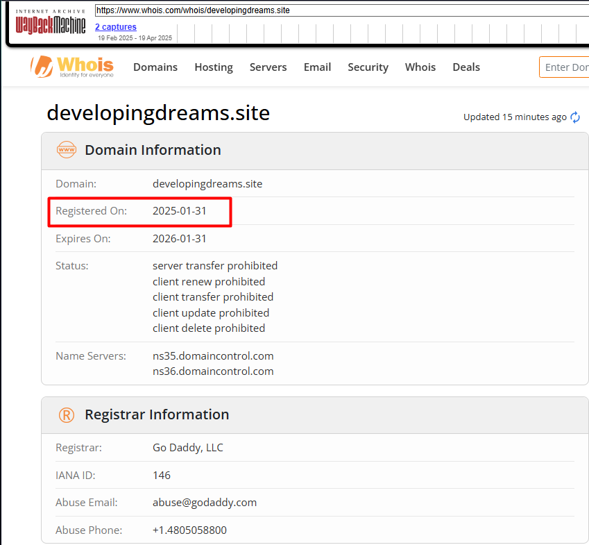

The domain was created on **2025-01-31** — registered shortly before the phishing email was sent, consistent with infrastructure set up specifically for this campaign.

**A:** `2025-01-31`

## Task 3: Resource Development sub-technique for domain registration

Looked this up on [attack.mitre.org](https://attack.mitre.org) under Resource Development.

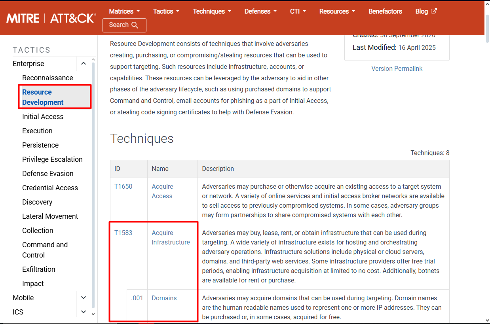

**A:** `T1583.001`

## Task 4: The company's X (Twitter) page

Browsed the archived site via [Wayback Machine](https://web.archive.org/web/20250204120033/https://developingdreams.site/).

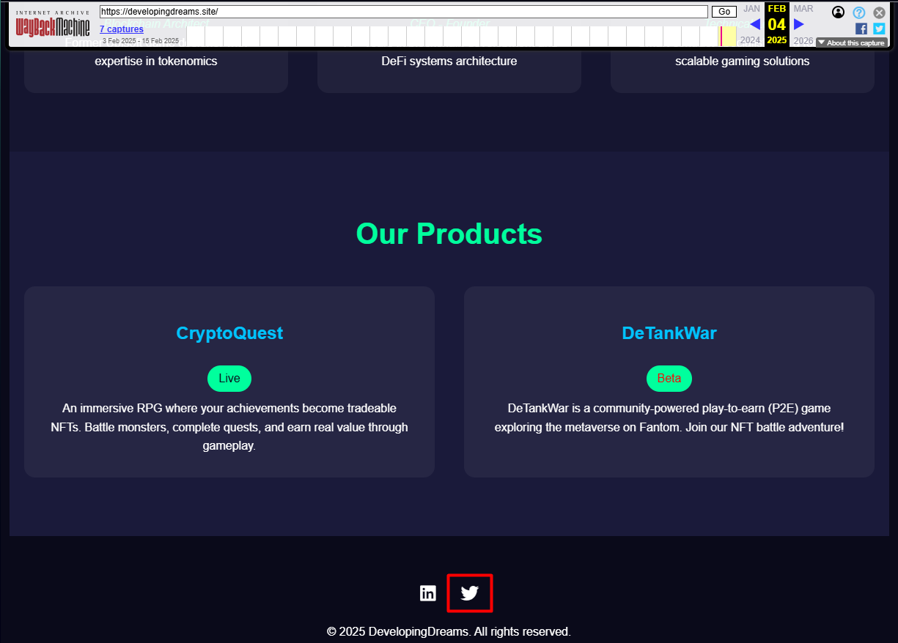

Clicking the X icon led to the company's profile:

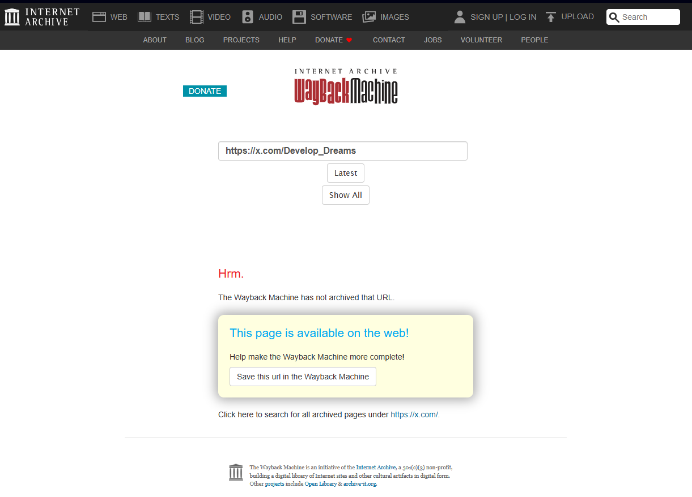

**A:** `https://x.com/Develop_Dreams`

## Task 5: Resource Development sub-technique for the social profile

The threat actor first made contact via that X profile before emailing — this maps to establishing accounts.

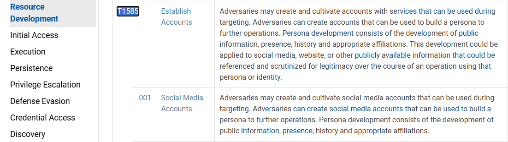

**A:** `T1585.001`

## Task 6: The game's name

Found on the archived site.

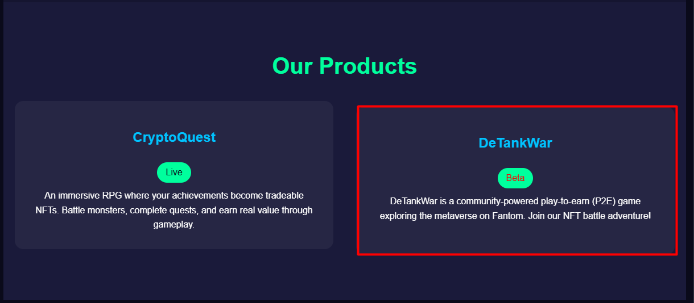

**A:** `DeTankWar`

## Task 7: SHA-256 of the shared executable

Downloaded the beta release from the site:


The archive was password-protected with `DTWBETA2025` from the email. After extracting, I hashed the `.exe`:

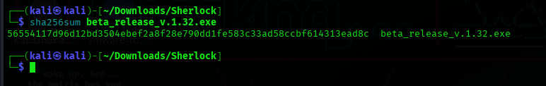

Cross-checked the hash on VirusTotal to confirm it was flagged as malicious:

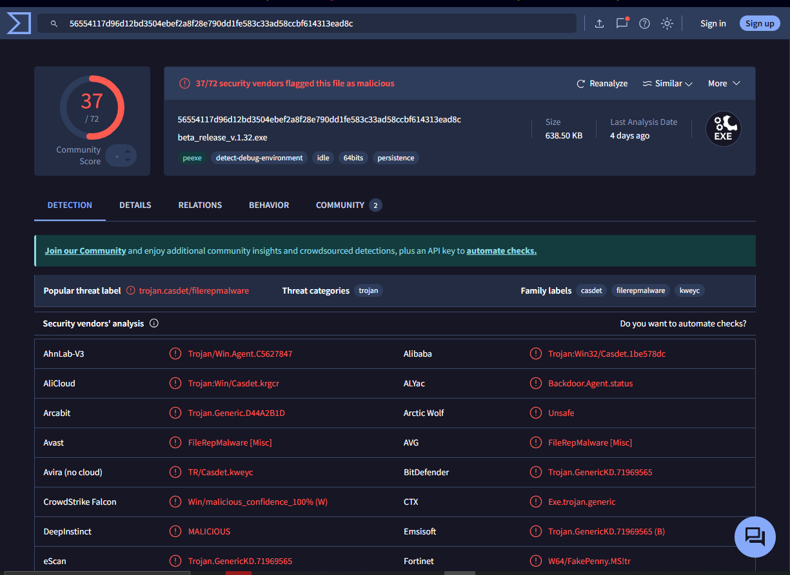

**A:** `56554117d96d12bd3504ebef2a8f28e790dd1fe583c33ad58ccbf614313ead8c`

## Task 8: Resource Development sub-technique for hosting the payload

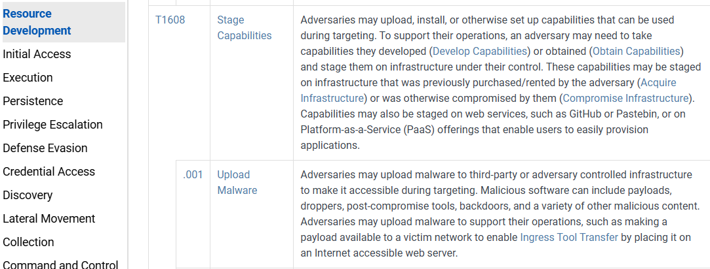

**A:** `T1608.001`

## Task 9 & 10: Threat actor and nation attribution

Correlating the fake game (DeTankWar), the freshly registered domain, and the social-engineering approach pointed to a known actor. [Microsoft's writeup](https://www.microsoft.com/en-us/security/blog/2024/05/28/moonstone-sleet-emerges-as-new-north-korean-threat-actor-with-new-bag-of-tricks/) confirmed it.

**A:** Moonstone Sleet — associated with **North Korea**

## Task 11: Trojanized tool used in another campaign

Per the same Microsoft blog and the [MITRE group page](https://attack.mitre.org/groups/G1036/) for Moonstone Sleet:

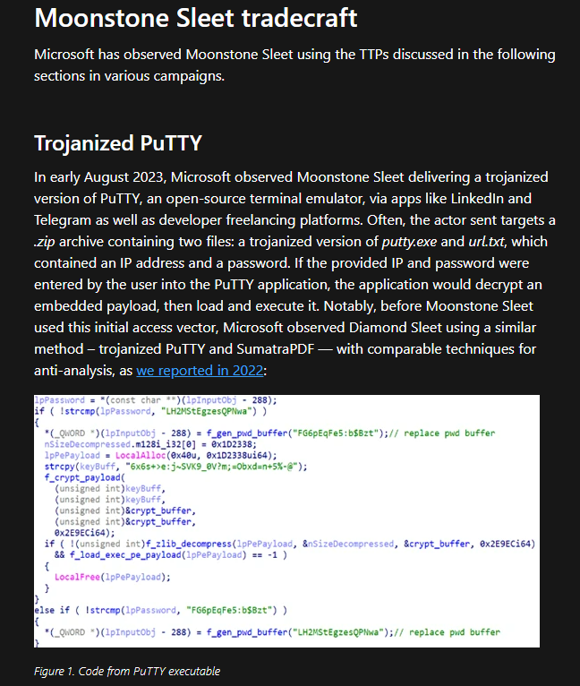

**A:** `PuTTY`

## Task 12: Technique for deploying trojanized software

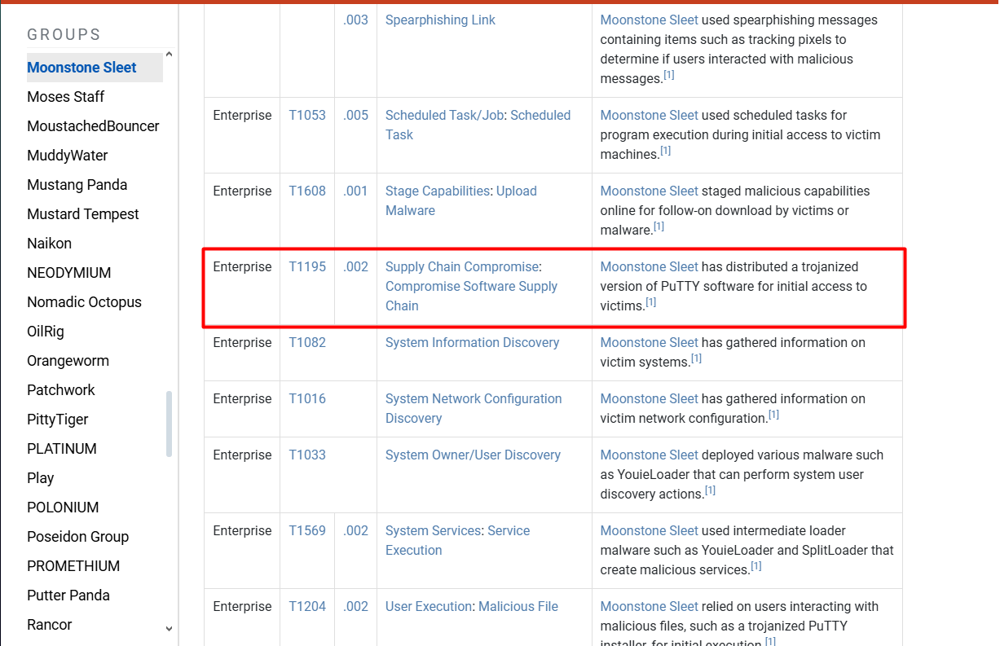

**A:** `T1195.002`

## Task 13: Related campaign and target technology

Researchers tracking techniques closely matching Moonstone Sleet found a supply-chain campaign in late July 2024 targeting **npm** packages.

**A:** `npm`

## Task 14: Latest malicious package

Found via [Datadog Security Labs](https://securitylabs.datadoghq.com/articles/stressed-pungsan-dprk-aligned-threat-actor-leverages-npm-for-initial-access/):

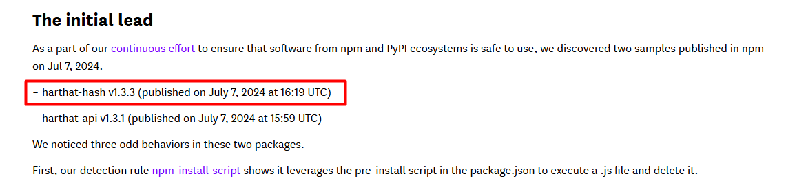

**A:** `harthat-hash v1.3.3`

## Task 15: C2 server IP

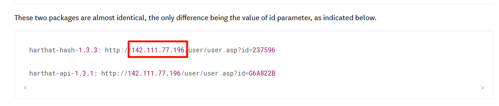

**A:** `142.111.77.196`

## Task 16: Defense evasion technique

The payload was renamed and executed via a legitimate, signed Windows binary — a classic way to blend in with trusted processes.

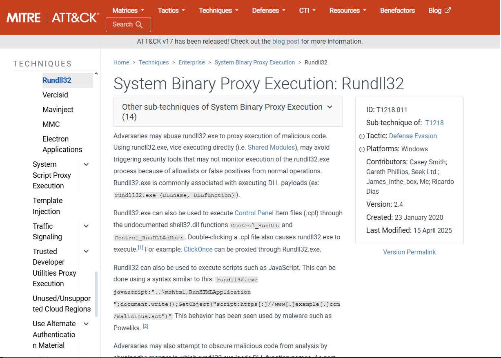

**A:** `T1218.011`

## Takeaway

The full chain — phishing → fake company/social presence → trojanized installer → renamed payload run via a trusted binary → npm supply-chain campaign — is a clean example of why resource-development indicators (freshly registered domains, brand-new social accounts) are worth flagging *before* the payload even lands.
