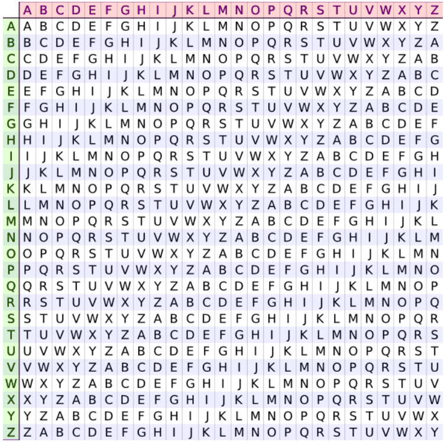

## Challenge Description

> "We intercepted this strange message from an old-school cryptographer. Can you recover the flag?"

This challenge tests knowledge of classical ciphers, specifically the **Vigenère cipher**. Participants are given a ciphertext that follows the standard CTF flag format, allowing them to perform a known-plaintext attack to recover the encryption key and decrypt the full message.

---

## Solution Walkthrough

### 🧠 Step 1: Observe the Ciphertext Structure

The provided ciphertext is:
"TEOVFJNQUG{WISFBFRQ_JG_FAEZ}" 

The format strongly resembles `SECURINETS{...}`, which is the expected flag prefix. This suggests:
- `TEOVFJNQUG` → `SECURINETS`
- The rest inside the braces is the encrypted payload.

### 🔑 Step 2: Recover the Vigenère Key

There are **two practical ways** to recover the key:

---

#### ✅ Method 1: Using the Vigenère Table (Manual)

Refer to the **Vigenère square** (also called tabula recta), as explained on [Bibmath.net](https://www.bibmath.net/crypto/index.php?action=affiche&quoi=poly/vigenere):

- To find the key letter: locate the **plaintext letter** on the **top row**, then find the **ciphertext letter** in that column. The **row header** is the key letter.

For example:
- Plaintext `S`, Ciphertext `T` → Key = `B`
- Plaintext `E`, Ciphertext `E` → Key = `A`
- Plaintext `C`, Ciphertext `O` → Key = `M`

Repeating this for all 10 letters:

| Plain | S | E | C | U | R | I | N | E | T | S |
|-------|---|---|---|---|---|---|---|---|---|---|
| Cipher| T | E | O | V | F | J | N | Q | U | G |
| Key   | B | A | M | B | O | B | A | M | B | O |

→ Key = `BAMBO`

> 📎  

---

#### ✅ Method 2: Using Modular Arithmetic (Programmatic)

As described on [GeeksforGeeks – Vigenère Cipher](https://www.geeksforgeeks.org/dsa/vigenere-cipher/), the Vigenère cipher follows:

- **Encryption**: `C[i] = (P[i] + K[i]) mod 26`
- **Decryption**: `P[i] = (C[i] - K[i]) mod 26`
- **Key recovery**: `K[i] = (C[i] - P[i]) mod 26`

Convert letters to numbers (`A=0, B=1, ..., Z=25`):

| Plain | S(18) | E(4) | C(2) | U(20) | R(17) | I(8) | N(13) | E(4) | T(19) | S(18) |
|-------|-------|------|------|-------|-------|------|-------|------|-------|-------|
| Cipher| T(19) | E(4) | O(14)| V(21) | F(5)  | J(9) | N(13) | Q(16)| U(20) | G(6)  |
| Key   | (19−18)=1 → B | (4−4)=0 → A | (14−2)=12 → M | ... | → **BAMBO** |

This confirms the same key: `BAMBO`.

### 🔓 Step 3: Decrypt the Full Ciphertext

Using the key `BAMBO`, decrypt the entire ciphertext (ignoring non-alphabetic characters like `{`, `_`, `}`):

- Ciphertext: `WISFBFRQ_JG_FAEZ`
- Key (repeated): `BAMBOBAM_BO_MBAM`

Apply Vigenère decryption:

### 🏁 Final Flag

Putting it all together:
 **Flag**: `SECURINETS{VIGENERE_IS_EASY}`
 
 ### 📚 References

- [Vigenère Cipher – Bibmath.net (French)](https://www.bibmath.net/crypto/index.php?action=affiche&quoi=poly/vigenere)
- [Vigenère Cipher – GeeksforGeeks](https://www.geeksforgeeks.org/dsa/vigenere-cipher/)

> 💡 Tip: For CTFs, always check if the ciphertext matches the expected flag format — it often gives you the plaintext needed to recover the key!
